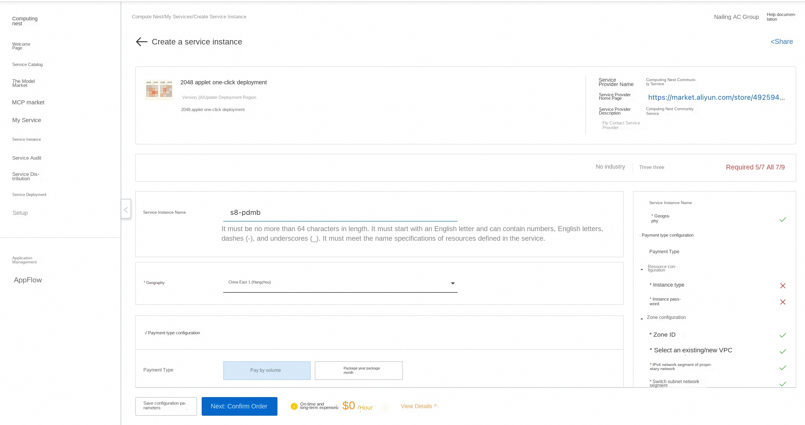
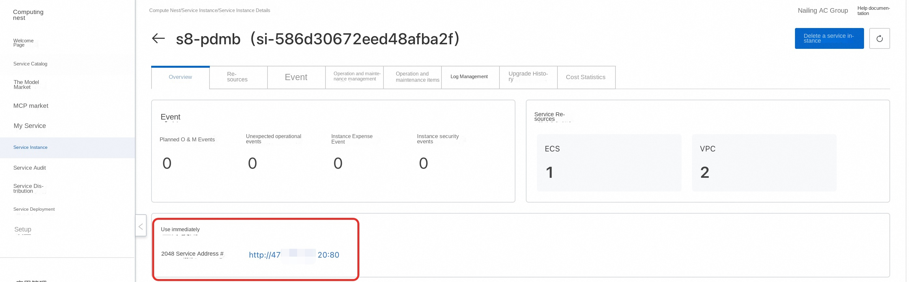

#2048 applet one-click deployment

## Deployment process
1. Visit the calculation nest 2048 applet [deployment link](https://computenest.console.aliyun.com/service/instance/create/cn-hangzhou?spm = 5176.24779694.0.0.627 f7f8bS7JeUs & type = user & ServiceId = service-bcf3d2fdd5e1444b88a0) and fill in the deployment parameters as prompted:

2. After completing the parameters, you can see the corresponding RFQ details. After confirming the parameters, click **Next: Confirm Order**.

3. Confirm that the order is complete and agree to the service agreement and click **Create Now** to enter the deployment phase.

4. After the deployment is completed, you can start using the service. Enter the service instance details and click the service address.

