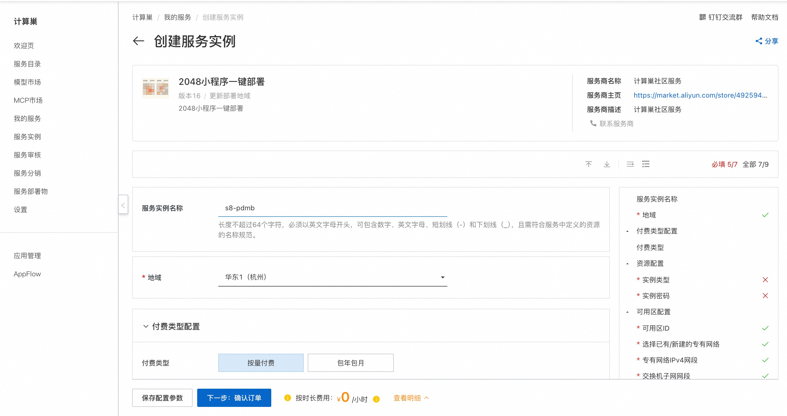
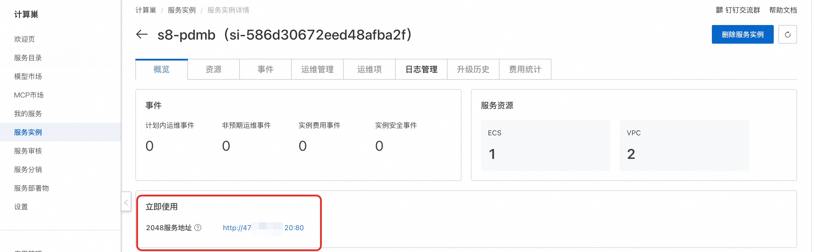

# 2048小程序一键部署

## 部署流程
1. 访问计算巢2048小程序[部署链接](https://computenest.console.aliyun.com/service/instance/create/cn-hangzhou?spm=5176.24779694.0.0.627f7f8bS7JeUs&type=user&ServiceId=service-bcf3d2fdd5e1444b88a0)，按提示填写部署参数：
   

2. 参数填写完成后可以看到对应询价明细，确认参数后点击**下一步：确认订单**。

3. 确认订单完成后同意服务协议并点击**立即创建**进入部署阶段。

4. 等待部署完成后就可以开始使用服务，进入服务实例详情点击服务地址。
   
